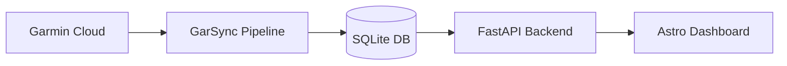

**GarSync** is a lightweight personal data pipeline designed to bridge the gap between Garmin Connect's proprietary cloud and your own local development environment.

It extracts activities, daily biometrics (Resting HR, Body Battery, Stress), and sleep data, storing them in a structured **SQLite database** for long-term ownership and analysis.

### Key Features

- **Automated Extraction:** Pulls raw data from Garmin Connect via private API.
- **Data Normalization:** Converts inconsistent API responses into clean, typed schemas.
- **REST API:** Exposes synced data through a high-performance **FastAPI** backend.
- **Dashboard:** A modern web UI built with **Astro** for visualizing trends and heatmaps.
- **Local Ownership:** Zero external dependencies for your data. It stays on your hardware.

### Architecture

GarSync is designed for self-hosting on low-power devices like a Raspberry Pi or a home NAS.
